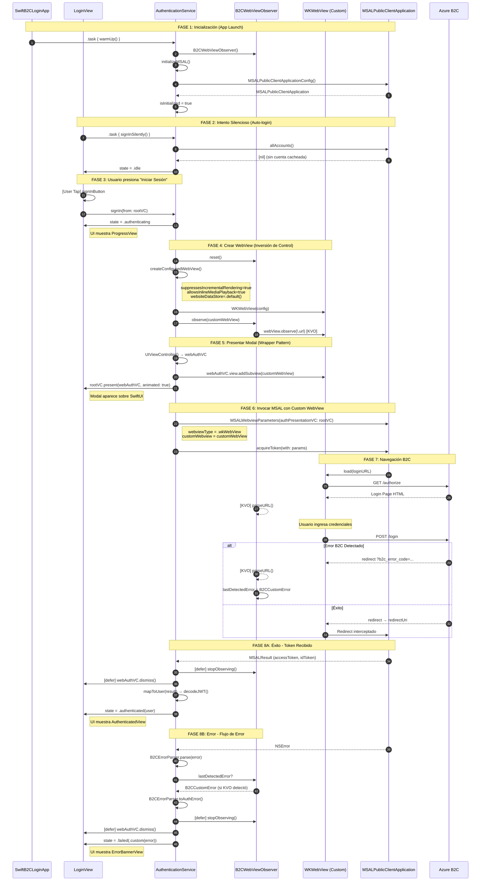
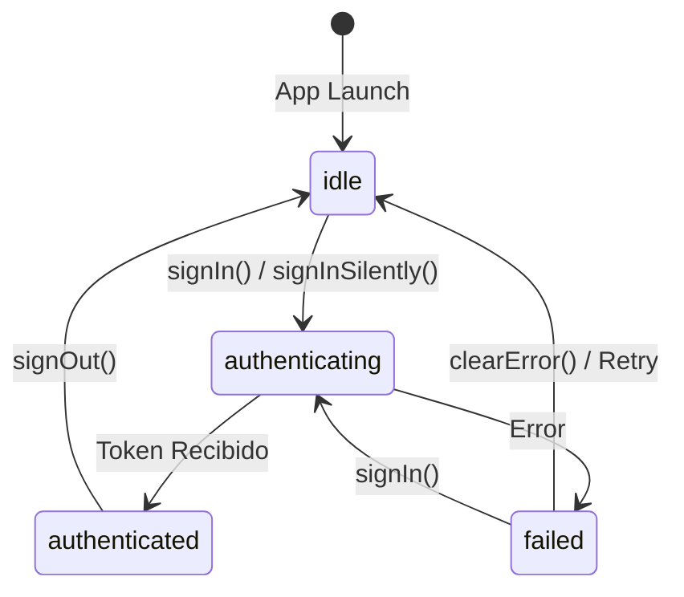

# Diagrama de Flujo - Arquitectura Login Con B2C usando Custom Web View

Este documento describe el flujo completo de autenticación implementado en la versión 3.1.0, utilizando el patrón de **Inversión de Control** donde la aplicación crea y gestiona el `WKWebView` en lugar de delegarlo a MSAL.

---

## Diagrama de Secuencia Principal


---

## Resumen de Clases y Métodos

### 1. `SwiftB2CLoginApp` (Entry Point)

| Método/Propiedad | Descripción |
|------------------|-------------|
| `authService` | `@State` que mantiene la instancia singleton |
| `.task { warmUp() }` | Pre-calienta el servicio al iniciar |
| `.onOpenURL` | Maneja el redirect URI de MSAL |

### 2. `LoginView` (Vista Principal)

| Método | Descripción |
|--------|-------------|
| `signIn()` | Obtiene `rootViewController` y llama a `authService.signIn()` |
| `signInSilently()` | Se ejecuta en `.task` al aparecer la vista |
| `contentView` | Switch sobre `authService.state` para mostrar UI apropiada |

### 3. `AuthenticationService` (Singleton @MainActor @Observable)

| Método | Descripción |
|--------|-------------|
| `warmUp()` | Inicializa MSAL y crea `B2CWebViewObserver` |
| `signIn(from:)` | Flujo interactivo completo |
| `signInSilently()` | Intenta usar tokens del Keychain |
| `signOut()` | Elimina cuentas del Keychain |
| `createConfiguredWebView()` | **Factory v3.1** - Crea WKWebView optimizado |
| `acquireTokenInteractively()` | Orquesta modal + MSAL + observer |
| `acquireTokenSilently()` | Adquiere token sin UI |
| `createMSALApplication()` | Configura MSAL con B2C authority |
| `mapToUser()` | Convierte MSALResult a AuthenticatedUser |
| `decodeJWT()` | Decodifica el ID Token |

### 4. `B2CWebViewObserver` (KVO Nativo)

| Método | Descripción |
|--------|-------------|
| `observe(_:)` | Inicia KVO en `webView.url` |
| `stopObserving()` | Invalida la observación y limpia referencias |
| `parseURL(_:)` | Extrae `b2c_error_code` y `error_description` de query params |
| `reset()` | Limpia `lastDetectedError` y reinicia el stream |
| `errors` | `AsyncStream<B2CCustomError>` para consumo reactivo |

### 5. `B2CErrorParser` (Utilidad Estática)

| Método | Descripción |
|--------|-------------|
| `parse(from:)` | Extrae `B2CCustomError` del `NSError` de MSAL |
| `toAuthError(_:)` | Convierte error genérico a `AuthError` tipado |
| `extractFromUserInfo()` | Busca JSON en claves conocidas del userInfo |
| `extractFromEmbeddedJSON()` | Usa regex para encontrar JSON embebido |

---

## Puntos Clave de la Arquitectura v3.1

### 1. Inversión de Control
La aplicación **crea** el `WKWebView` y se lo pasa a MSAL, en lugar de dejar que MSAL lo cree internamente.

```swift
let customWebView = createConfiguredWebView()  // Nosotros lo creamos
webViewParameters.customWebview = customWebView  // Se lo pasamos a MSAL
```

### 2. Observación Síncrona (t=0)
El observer KVO se conecta **inmediatamente** después de crear el WebView, antes de que MSAL cargue contenido.

```swift
let customWebView = createConfiguredWebView()
webViewObserver?.observe(customWebView)  // ← Observación desde el momento 0
// ... luego MSAL usa el WebView
```

### 3. Patrón Wrapper Modal
Un `UIViewController` temporal contiene el WebView y se presenta modalmente para evitar conflictos con la jerarquía de `UIHostingController` de SwiftUI.

```swift
let webAuthVC = UIViewController()
webAuthVC.view.addSubview(customWebView)
viewController.present(webAuthVC, animated: true)
```

### 4. Doble Detección de Errores

| Fuente | Método | Prioridad |
|--------|--------|-----------|
| KVO (URL) | `B2CWebViewObserver.lastDetectedError` | Alta |
| MSAL NSError | `B2CErrorParser.parse(from:)` | Fallback |

```swift
// Primero verificar KVO
if let detectedError = webViewObserver?.lastDetectedError {
    state = .failed(.custom(detectedError))
    return
}

// Fallback: parsear NSError de MSAL
let authError = B2CErrorParser.toAuthError(error)
state = .failed(authError)
```

---

## Configuración del WKWebView (Factory v3.1)

| Parámetro | Valor | Propósito |
|-----------|-------|-----------|
| `websiteDataStore` | `.default()` | Persistencia de cookies de sesión B2C |
| `suppressesIncrementalRendering` | `true` | Evita "flash" blanco durante redirects |
| `allowsInlineMediaPlayback` | `true` | Soporta flujos QR+PIN |
| `allowsBackForwardNavigationGestures` | `false` | Previene swipe-back accidental |
| `isInspectable` | `true` (DEBUG) | Permite Web Inspector |

---

## Estados de la Aplicación (`AuthState`)



---

*Última actualización: Febrero 2026*
