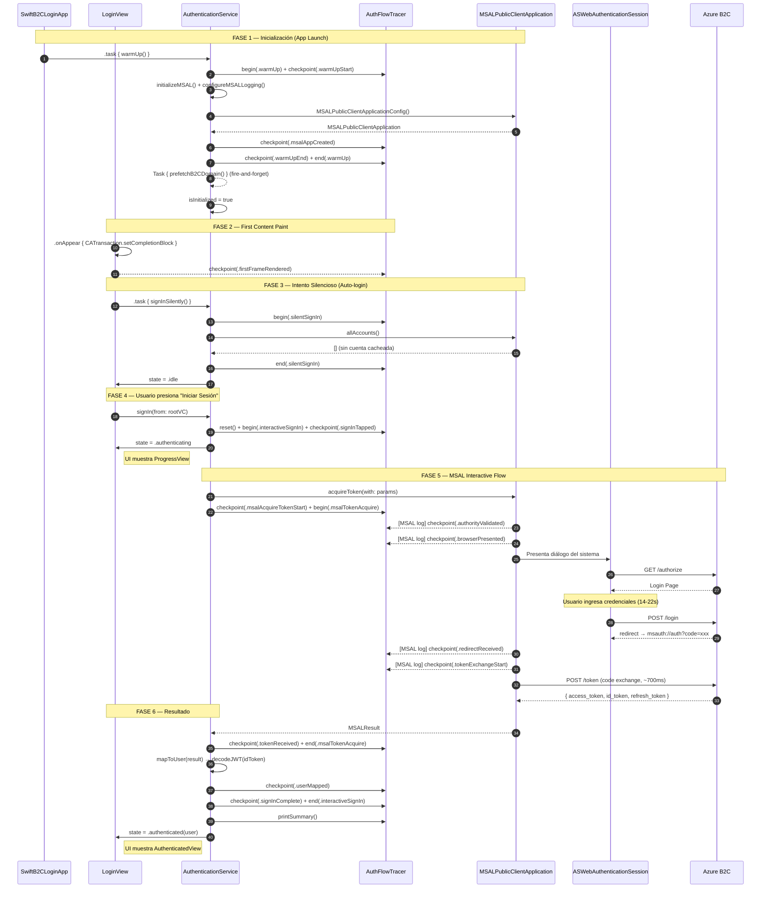

## Diagrama de Secuencia

```mermaid
sequenceDiagram
    autonumber
    participant App as SwiftB2CLoginApp
    participant View as LoginView
    participant Auth as AuthenticationService
    participant Tracer as AuthFlowTracer
    participant MSAL as MSALPublicClientApplication
    participant ASWeb as ASWebAuthenticationSession
    participant B2C as Azure B2C

    %% FASE 1: INICIALIZACIÓN
    Note over App,MSAL: FASE 1 — Inicialización (App Launch)
    App->>Auth: .task { warmUp() }
    Auth->>Tracer: begin(.warmUp) + checkpoint(.warmUpStart)
    Auth->>Auth: initializeMSAL() + configureMSALLogging()
    Auth->>MSAL: MSALPublicClientApplicationConfig()
    MSAL-->>Auth: MSALPublicClientApplication
    Auth->>Tracer: checkpoint(.msalAppCreated)
    Auth->>Tracer: checkpoint(.warmUpEnd) + end(.warmUp)
    Auth-->>Auth: Task { prefetchB2CDomain() } (fire-and-forget)
    Auth->>Auth: isInitialized = true

    %% FASE 2: FIRST CONTENT PAINT
    Note over View,Tracer: FASE 2 — First Content Paint
    View->>View: .onAppear { CATransaction.setCompletionBlock }
    View-->>Tracer: checkpoint(.firstFrameRendered)

    %% FASE 3: INTENTO SILENCIOSO
    Note over View,MSAL: FASE 3 — Intento Silencioso (Auto-login)
    View->>Auth: .task { signInSilently() }
    Auth->>Tracer: begin(.silentSignIn)
    Auth->>MSAL: allAccounts()
    MSAL-->>Auth: [] (sin cuenta cacheada)
    Auth->>Tracer: end(.silentSignIn)
    Auth->>View: state = .idle

    %% FASE 4: USUARIO INICIA SESIÓN
    Note over View,Auth: FASE 4 — Usuario presiona "Iniciar Sesión"
    View->>Auth: signIn(from: rootVC)
    Auth->>Tracer: reset() + begin(.interactiveSignIn) + checkpoint(.signInTapped)
    Auth->>View: state = .authenticating
    Note right of View: UI muestra ProgressView

    %% FASE 5: MSAL + BROWSER
    Note over Auth,B2C: FASE 5 — MSAL Interactive Flow
    Auth->>MSAL: acquireToken(with: params)
    Auth->>Tracer: checkpoint(.msalAcquireTokenStart) + begin(.msalTokenAcquire)
    MSAL-->>Tracer: [MSAL log] checkpoint(.authorityValidated)
    MSAL-->>Tracer: [MSAL log] checkpoint(.browserPresented)
    MSAL->>ASWeb: Presenta diálogo del sistema
    ASWeb->>B2C: GET /authorize
    B2C-->>ASWeb: Login Page

    Note over ASWeb: Usuario ingresa credenciales (14-22s)
    ASWeb->>B2C: POST /login
    B2C-->>ASWeb: redirect → msauth://auth?code=xxx
    MSAL-->>Tracer: [MSAL log] checkpoint(.redirectReceived)
    MSAL-->>Tracer: [MSAL log] checkpoint(.tokenExchangeStart)
    MSAL->>B2C: POST /token (code exchange, ~700ms)
    B2C-->>MSAL: { access_token, id_token, refresh_token }

    %% FASE 6: RESULTADO
    Note over Auth,View: FASE 6 — Resultado
    MSAL-->>Auth: MSALResult
    Auth->>Tracer: checkpoint(.tokenReceived) + end(.msalTokenAcquire)
    Auth->>Auth: mapToUser(result) → decodeJWT(idToken)
    Auth->>Tracer: checkpoint(.userMapped)
    Auth->>Tracer: checkpoint(.signInComplete) + end(.interactiveSignIn)
    Auth->>Tracer: printSummary()
    Auth->>View: state = .authenticated(user)
    Note right of View: UI muestra AuthenticatedView
```