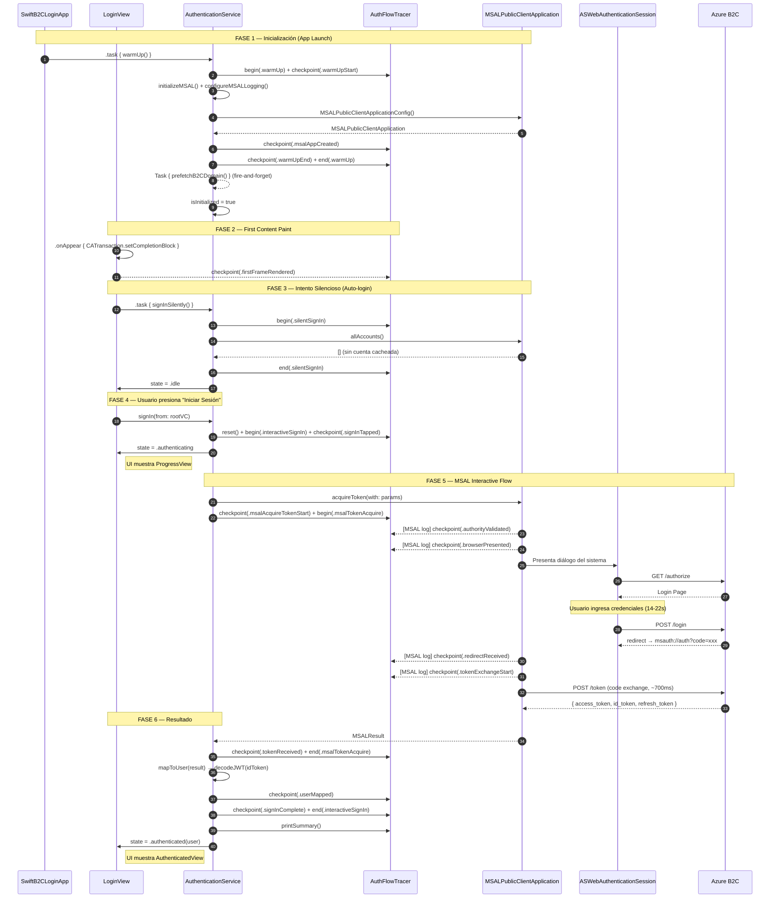
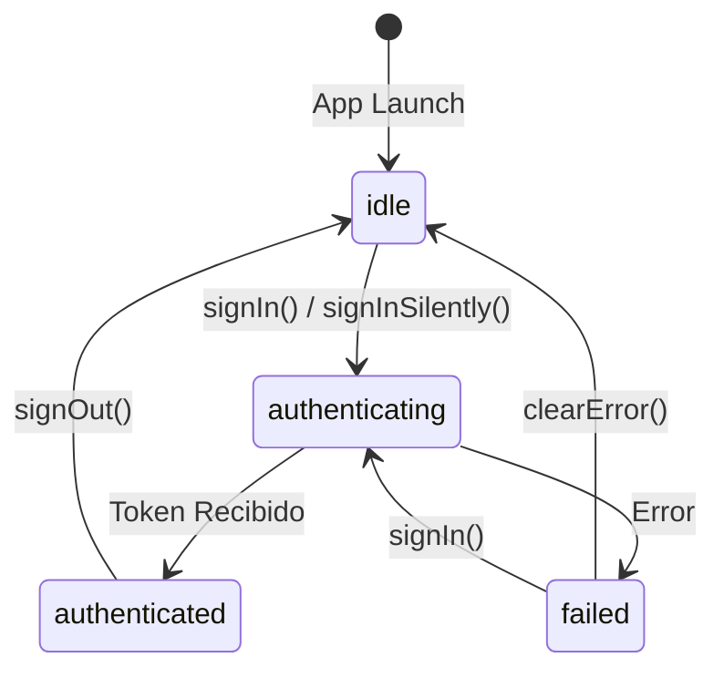

# Arquitectura v3 — Swift B2C Login

Autenticación contra Azure AD B2C usando MSAL con `ASWebAuthenticationSession` (modo `.default`), instrumentación de rendimiento con `AuthFlowTracer`, y arquitectura reactiva con `@Observable`.

---

## Diagrama de Secuencia



---

## Estructura del Proyecto

```
SwiftB2CLogin/
├── App/
│   └── SwiftB2CLoginApp.swift          # Entry point, warmUp + onOpenURL
├── B2C/
│   ├── B2CConfiguration.swift          # Tenant, clientId, authority, redirectUri
│   ├── B2CCustomError.swift            # Modelo de errores B2C Custom Policies
│   ├── B2CErrorParser.swift            # Parser JSON/URL → B2CCustomError (Swift Regex)
│   └── B2CSecrets.swift                # Secrets excluidos del repo (.gitignore)
├── Core/
│   ├── AuthError.swift                 # Enum tipado de errores con severity
│   └── AuthState.swift                 # FSM: idle → authenticating → authenticated/failed
├── Services/
│   ├── AuthenticationService.swift     # @Observable @MainActor — MSAL interactivo/silencioso
│   ├── AuthFlowTracer.swift            # ContinuousClock + OSSignposter instrumentación
│   └── Logger.swift                    # Protocol + PrintLogger (Date.FormatStyle)
└── Views/
    ├── LoginView.swift                 # Vista principal con FCP measurement
    └── Components/
        └── ErrorBannerView.swift       # Banner de error con severity + retry
```

---

## Componentes Principales

### AuthenticationService

`@MainActor @Observable` — Singleton que gestiona el flujo MSAL completo.

| Método | Descripción |
|--------|-------------|
| `warmUp()` | Inicializa MSAL, configura logging verbose, y lanza DNS prefetch en background |
| `signIn(from:)` | Flujo interactivo: reset tracer → `.authenticating` → `acquireToken` → `.authenticated` |
| `signInSilently()` | Renueva tokens desde Keychain sin UI |
| `signOut()` | Elimina cuentas cacheadas con `defer { state = .idle }` |
| `configureMSALLogging()` | Intercepta logs MSAL verbose y emite checkpoints del tracer por keyword matching |

### AuthFlowTracer

`@MainActor` — Instrumentación con `ContinuousClock` y `OSSignposter`.

**17 Milestones** organizados en fases:

| Fase | Milestones |
|------|-----------|
| Warm-up | `warmUpStart` → `msalAppCreated` → `warmUpEnd` |
| FCP | `firstFrameRendered` |
| Interactive | `signInTapped` → `msalAcquireTokenStart` → `authorityValidated` → `browserPresented` → `redirectReceived` → `tokenExchangeStart` → `tokenReceived` → `userMapped` → `signInComplete` |
| Silent | `silentSignInStart` → `silentTokenRequested` → `silentSignInEnd` |
| Sign-out | `signOutStart` → `signOutEnd` |

**5 Intervals** para Instruments: `WarmUp`, `InteractiveSignIn`, `SilentSignIn`, `SignOut`, `MSALTokenAcquire`

Los 4 milestones MSAL (`authorityValidated`, `browserPresented`, `redirectReceived`, `tokenExchangeStart`) se capturan vía keyword matching en el callback de `MSALGlobalConfig.loggerConfig.setLogCallback`.

### B2CErrorParser

Parser estático con Swift `Regex` (sin `NSRegularExpression`). Dos estrategias:

1. **`parse(from: Error)`** — Extrae `B2CCustomError` del `NSError` de MSAL buscando JSON en `userInfo`
2. **`toAuthError(_:)`** — Convierte cualquier error a `AuthError` tipado con severity

### AuthState (FSM)



---

## Rendimiento Típico

```
┌─────────────────────────────────────────────────────────┐
│            AUTH FLOW PERFORMANCE SUMMARY                 │
├────┬─────────────────────────┬──────────┬───────────────┤
│  # │ Checkpoint              │ Delta    │ Cumulative    │
├────┼─────────────────────────┼──────────┼───────────────┤
│ 01 │ sign in tapped          │ 0ms      │ 0ms           │
│ 02 │ msal acquire token star │ 5ms      │ 5ms           │
│ 03 │ authority validated     │ 58ms     │ 64ms          │
│ 04 │ browser presented       │ 0ms      │ 64ms          │
│ 05 │ redirect received       │ 14-22s   │ ~14-22s       │
│ 06 │ token exchange start    │ 0ms      │ ~14-22s       │
│ 07 │ token received          │ 700-1100 │ ~15-23s       │
│ 08 │ user mapped             │ 0ms      │ ~15-23s       │
│ 09 │ sign in complete        │ 0ms      │ ~15-23s       │
└────┴─────────────────────────┴──────────┴───────────────┘
```

| Métrica | Valor |
|---------|-------|
| **First Content Paint** | ~235ms |
| **WarmUp** | ~3ms |
| **Silent Sign-In** (sin cache) | ~5ms |
| **Authority validation** | ~60ms (cacheado por DNS prefetch) |
| **Token exchange** (code → tokens) | ~700-1100ms |
| **System overhead total** | ~800ms (excluyendo interacción humana) |

---

## Tokens

MSAL devuelve tres tokens en `MSALResult` (checkpoint 07):

| Token | Propiedad | Uso |
|-------|----------|-----|
| **Access Token** | `result.accessToken` | `Authorization: Bearer <token>` para llamar APIs protegidas |
| **ID Token** | `result.idToken` | Claims del usuario (nombre, email). Solo para la app |
| **Refresh Token** | *(interno MSAL)* | Guardado en Keychain. Usado por `acquireTokenSilently()` |

> Para que el access token incluya permisos de API, configurar scopes custom en `B2CConfiguration.scopes`.

---

*Última actualización: Marzo 2026*
